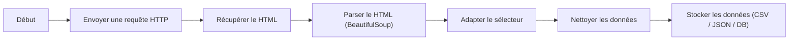

# Python WebScraping

### 1. Vue d'ensemble

Les web scraping consiste à récupérer automatiquement des informations depuis des pages web à l'aide d'un script, au lieu de les copier manuellement. Ça permet de faire différente chose tel que extraire des prix, des articles, des fiches produits, des données publiques... 

L'automatisation de tâche comme celle-ci permet un gain de temps conséquent et collecte de grandes quantités de données 

Le scraping repose sur plusieurs étapes :
1. Envoyer une requête HTTP vers un site
2. Récupérer le contenu HTML de la page
3. Analyser ce HTML
4. Extraire les données souhaitées
5. Stocker ou exploiter les données

### 2. Structure d'une page web

Une page web est généralement composée de :

**HTML** : structure (balises)
**CSS** : mise en forme
**JavaScript** : comportement dynamique

### Les limites

Le scraping classique se confronte à des limites bloquantes

- contenu chargé via JavaScript
- structure HTML instable
- protection anti-bot
- captchas
- blocage IP

### Aspects légaux et éthiques

À vérifier :
- conditions d’utilisation du site
- fichier robots.txt
- données publiques vs privées

Bonnes pratiques :
- ne pas surcharger le serveur
- ajouter des délais entre requêtes
- identifier son script (User-Agent)

---

