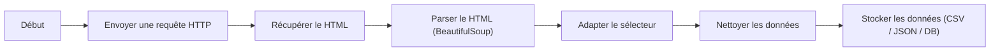

# Python WebScraping

### 1. Vue d'ensemble

Les web scraping consiste à récupérer automatiquement des informations depuis des pages web à l'aide d'un script, au lieu de les copier manuellement. Ça permet de faire différente chose tel que extraire des prix, des articles, des fiches produits, des données publiques... 

L'automatisation de tâche comme celle-ci permet un gain de temps conséquent et collecte de grandes quantités de données 

Le scraping repose sur plusieurs étapes :
1. Envoyer une requête HTTP vers un site
2. Récupérer le contenu HTML de la page
3. Analyser ce HTML
4. Extraire les données souhaitées
5. Stocker ou exploiter les données

### 2. Structure d'une page web

Une page web est généralement composée de :

**HTML** : structure (balises)
**CSS** : mise en forme
**JavaScript** : comportement dynamique

### 3. Les limites

Le scraping classique se confronte à plusieurs limites importantes

- contenu chargé dynamiquement via JavaScript
- structure HTML instable
- protection anti-bot
- captchas
- blocage IP

Lorsqu’un script de scraping effectue une requête HTTP, il récupère uniquement le contenu HTML renvoyé par le serveur au moment de la réponse.

Or, certains sites web chargent une partie de leur contenu après coup, grâce à JavaScript (par exemple via des requêtes asynchrones). Ce contenu est alors généré dans le navigateur, et non dans la réponse initiale du serveur.

Par conséquent, ce contenu dynamique est invisible pour un script de scraping classique utilisant des outils comme ``requests``.

Certains outils pro peuvent contourner ces limites, mais ce n'est pas le sujet du cours

### 4. Aspects légaux et éthiques

Avant de mettre en place un script de scraping, il est important de vérifier certains éléments :

- conditions d’utilisation du site
- fichier robots.txt
- la nature des données (publiques ou privées)

Lors du scraping, il est recommandé de respecter certaines bonnes pratiques :

- ne pas surcharger le serveur
- ajouter des délais entre requêtes
- identifier son script (User-Agent)

---

