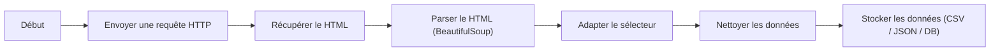

# Framework Flask

### 1. Vue d'ensemble

Les web scraping consiste à récupérer automatiquement des informations depuis des pages web à l'aide d'un script, au lieu de les copier manuellement. Ça permet de faire différente chose tel que extraire des prix, des articles, des fiches produits, des données publiques... 

L'automatisation de tâche comme celle-ci permet un gain de temps conséquent et collecte de grandes quantités de données 

Le scraping repose sur plusieurs étapes :
1. Envoyer une requête HTTP vers un site
2. Récupérer le contenu HTML de la page
3. Analyser ce HTML
4. Extraire les données souhaitées
5. Stocker ou exploiter les données


### 2. Installation

Créez d'abord le dossier du projet, puis :

```bash
python -m venv venv
```

```bash
venv\Scripts\activate
```

```bash
pip install flask
```

#### Première page

```python
from flask import Flask

app = Flask(__name__)

@app.route("/")
def home():
    return "Hello World !"

if __name__ == "__main__":
    app.run(debug=True)
```

#### Lancer le serveur

```bash
python app.py
```

On peut ensuite accéder à notre première page a cette URL : http://127.0.0.1:5000


---


