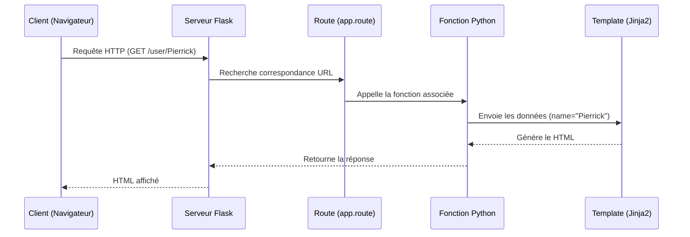

# Système de route

### 1. Vue d'ensemble

Dans Flask, une route permet d’associer une URL à une fonction Python. Lorsqu’un utilisateur accède à une URL depuis le navigateur, une requête HTTP est envoyée au serveur.

Flask analyse cette requête et cherche une route correspondante grâce au décorateur @app.route. Si une correspondance est trouvée, la fonction associée est exécutée.

Les routes peuvent contenir des paramètres dynamiques, ce qui permet de récupérer des valeurs directement depuis l’URL. Par exemple, ``/user/<name>`` permet de récupérer le nom d’un utilisateur.

La fonction appelée peut ensuite générer une réponse. Dans la plupart des cas, cette réponse est du HTML Une fois la réponse générée, Flask l’envoie au navigateur, qui l’affiche à l’utilisateur.




### 2. Le système de route


```python
@app.route("/")
def about():
    return "Page d'accueil"
```
Exemple avec l'URL racine sans paramètre

Ici la fonction retour un contenu que le navigateur affichera, dans notre cas un simple texte. 

#### Récupérer un paramètre

On peut récupérer des paramètres dynamiquement via l'URL, c'est qui permet de générer du contenu selon une données en une seule route

```python
@app.route("/user/<name>")
def user(name):
    return "Hello " + name
```

`<name>` indique que ce qui va se trouver à cette emplacement sera un paramètre que l'on pourrait traiter

`def user(name):` ici on appelle la fonction et on recupère le contenu de `name` qui sera utilisé dans cette même fonction

``return "Hello " + name`` on affiche un message selon la donnée récupérée

Exemple : 

URL : `http://127.0.0.1:5000/user/pierrick`
Résultat dans le navigateur : `Hello pierrick`

### 3. Organiser nos routes

Sans surprise, on va éviter de mettre toutes nos routes dans le fichier sinon ce sera illisible avec le temps. On peut donc organiser le projet afin d'avoir plus de cohérence dans l'arborescence

On va donc se retrouver avec une arborescence similaire à celle-ci

```
mon_projet/
│
├── app.py
├── routes/
│   ├── main.py
│   ├── users.py
│   └── articles.py
```

- ``main.py`` contiendra les routes générales
- ``users.py`` contient les routes liées aux utilisateurs
- ``articles.py`` contient les routes liées aux articles

Pour faire fonctionner tout ça, on va utiliser ce qu'on appelle des **Blueprint**

#### Blueprint

Un Blueprint permet de regrouper des routes

Notre fichier principale ressemblera à ça :

```python
from flask import Flask
from routes.main import main_bp
from routes.users import users_bp
from routes.articles import articles_bp

app = Flask(__name__)

app.register_blueprint(main_bp)
app.register_blueprint(users_bp, url_prefix="/users")
app.register_blueprint(articles_bp, url_prefix="/articles")

if __name__ == "__main__":
    app.run(debug=True)
```

Le **``main.py``** : 

```python
from flask import Blueprint, render_template

main_bp = Blueprint("main", __name__)

@main_bp.route("/")
def home():
    return "L'accueil"
```

Le **``user.py``** : 

```python
from flask import Blueprint, render_template

users_bp = Blueprint("users", __name__)

@users_bp.route("/")
def list_users():
    return "La liste des utilisateurs"
```
---


Le problème c'est que si on veut renvoyer du HTML, c'est long à écrire et on mélange un peu la logique
On peut donc, et c'est le but, retourner directement un template