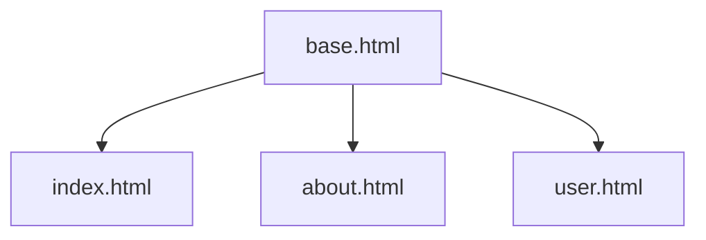

# Les templates avec Jinja2

### 1. Vue d'ensemble

Dans une application web, il est important de séparer la logique du programme de l’affichage. Les templates permettent de générer des pages HTML dynamiques à partir de données envoyées par le serveur.

Flask utilise le moteur de templates Jinja2. Ce moteur permet d’insérer des variables dans le HTML, mais aussi d’utiliser des structures comme des conditions ou des boucles.

Les templates sont stockés dans un dossier nommé templates. Ils contiennent du HTML classique, enrichi par une syntaxe spécifique :

- ``{{ }}`` pour afficher des variables
- ```` pour exécuter des instructions

Lorsqu’une route est appelée, Flask peut utiliser la fonction render_template pour envoyer des données au template. Le moteur Jinja2 remplace alors les variables par leurs valeurs et génère une page HTML finale.

Cette page est ensuite envoyée au navigateur.

### 2. Démo d'un template

Tout d'abord, pensez a créer le dossier **`templates`** dans votre projet. C'est ici que sera contenu tous vos templates et qui seront accessible via une fonction bien rpécise de **Flask**

La fonction **`render_template()`** permet de rendre un template se trouvant dans le dossier ``/templates``

```python
from flask import Flask, render_template

app = Flask(__name__)

@app.route("/hello/<name>")
def hello(name):
    return render_template("hello.html", name=name)

if __name__ == "__main__":
    app.run(debug=True)
```

Notre template dans : **`templates/hello.html`**

```html
<!DOCTYPE html>
<html>
<head>
    <title>Demo</title>
</head>
<body>
    <h1>Bonjour {{ name }}</h1>
</body>
</html>
```

### Les conditions / boucle

Dans un template, comme dit plus tôt, vous pouvez conditionner un affichage ou boucler sur un tableau pour afficher la liste des utilisateurs par exemple, pour rappel les instrutions sont executées entre **``**

La syntaxe est la suivante :

**Condition**

```python

    Majeur

```

**Boucle**

Pour l'exemple, on suppose que la variable `users` est envoyé dans le template
```python

    Utilisateur : {{ user }}

```
---


### 2. Etendre un template

Dans Flask, le moteur de templates Jinja2 permet de réutiliser une structure HTML commune grâce au mécanisme d’héritage.

Le mot-clé extends permet à un template d’hériter d’un autre template, généralement appelé template de base. Ce template de base contient la structure globale de la page (balises HTML, en-tête, pied de page, etc.). En gros on découpe tout pour rendre ça plus maintenable

Des zones appelées ``blocs`` sont définies dans le template de base à l’aide de la syntaxe . Ces blocs peuvent ensuite être remplacés dans les templates enfants.



Toutes les pages utiliseront la même structure

#### Exemple 

Fichier **`base.html`**
```html
<!DOCTYPE html>
<html>
<head>
    <title></title>
</head>
<body>

<header>
    <h1>Mon site tout moche</h1>
</header>

<main>
    
</main>

<footer>
    <p>Magnifique pied de page de fou</p>
</footer>

</body>
</html>
```

Ici on a définit des zones modificables :
- `title`
- `content`

Puis la page qui va hériter de la structure :

Fichier **`index.html`**

```html



Accueil



<h2>Bienvenue sur le site</h2>

```

Pour résumé, il se passe ça :
1. Flask et Jinja2 charge la page `index.html`
2. Voit ``
3. Charge ``base.html``
4. Remplace les blocs avec le contenu définit dans `index.html`

> Important : **``extends``** doit être la première ligne du fichier