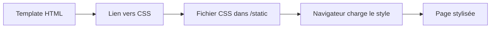

# Les templates avec Jinja2

### 1. Stylisé nos pages




### Dossier static

**Exemple d'arborescence**

mon_projet/
│
├── ``app.py``
├── ``templates/``
│   └── ``base.html``
└── ``static/``
    └── ``css/``
        └── ``style.css``

### Lier le CSS dans un template

```html
<head>
    <link rel="stylesheet" href="{{ url_for('static', filename='css/style.css') }}">
</head>
```

`` {{ url_for(...)}}`` va permettre de lié le CSS au template. Ce n'est pas la seule utilisation de cette fonction, on peut très bien faire de la redirection vers une autre URL (route)

Exemple : ``{{ url_for('index')}}``
### 2. Exemple complet

#### `base.html`

```html
<!DOCTYPE html>
<html>
<head>
    <title></title>

    <link rel="stylesheet" href="{{ url_for('static', filename='css/style.css') }}">
</head>
<body>

<header>
    <h1>Le site du futur</h1>
</header>

<main>
    
</main>

</body>
</html>
```

#### `index.html`

```html


Accueil


<h1>Bienvenue</h1>
<p>Page stylisée avec CSS</p>

```

#### `static/css/style.css`

```css
body {
    font-family: Arial;
    background-color: #f5f5f5;
}

h1 {
    color: blue;
}
```
