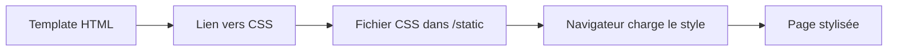

#  Style CSS

### Vue d'ensemble

Dans une application Flask, les fichiers statiques comme le CSS, le JavaScript ou les images sont placés dans un dossier appelé static.

Pour appliquer un style à une page, il est nécessaire de créer un fichier CSS dans ce dossier, puis de le lier dans un template HTML.

Flask fournit la fonction url_for qui permet de générer automatiquement le chemin vers un fichier statique. Cela garantit que les ressources seront correctement chargées, quel que soit l’environnement (développement ou production).

Dans une application Flask, les fichiers statiques comme le CSS, le JavaScript ou les images sont placés dans un dossier appelé static.

Une des pratique consiste à inclure les fichiers CSS dans un template de base (avec extends), afin que toutes les pages héritent du même style. Puis si necessaire vous pourrez inclure un fichier spécifique a une page en utilisant des `` et en faisant hériter celui du template parent

Cette organisation permet de structurer correctement une application web et de séparer clairement le contenu (HTML) du style (CSS).



### 2. Stylisé nos pages

### Dossier static

**Exemple d'arborescence**

mon_projet/
│
├── ``app.py``
├── ``templates/``
│   └── ``base.html``
└── ``static/``
    └── ``css/``
        └── ``style.css``

### Lier le CSS dans un template

```html
<head>
    <link rel="stylesheet" href="{{ url_for('static', filename='css/style.css') }}">
</head>
```

`` {{ url_for(...)}}`` va permettre de lié le CSS au template. Ce n'est pas la seule utilisation de cette fonction, on peut très bien faire de la redirection vers une autre URL (route)

Exemple : ``{{ url_for('index')}}``
### 2. Exemple complet

#### `base.html`

```html
<!DOCTYPE html>
<html>
<head>
    <title></title>

    <link rel="stylesheet" href="{{ url_for('static', filename='css/style.css') }}">
</head>
<body>

<header>
    <h1>Le site du futur</h1>
</header>

<main>
    
</main>

</body>
</html>
```

#### `index.html`

```html


Accueil


<h1>Bienvenue</h1>
<p>Page stylisée avec CSS</p>

```

#### `static/css/style.css`

```css
body {
    font-family: Arial;
    background-color: #f5f5f5;
}

h1 {
    color: blue;
}
```
